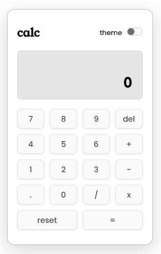

# Calculator

This is a simple calculator application built using vanilla JavaScript. The application supports basic arithmetic operations, including addition, subtraction, multiplication, and division.

## Demo

